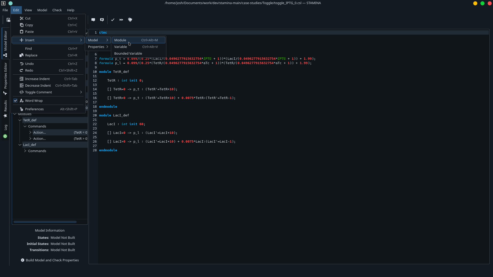

# STAMINA (STORM Integration)

[](https://www.codefactor.io/repository/github/fluentverification/stamina-storm)


C++ version of `stamina` integrating with the `storm` probabilistic model checker at [https://github.com/moves-rwth/storm](https://github.com/moves-rwth/storm). This version is different from the [Java version](https://github.com/fluentverification/stamina ), and is under active development. STAMINA/STORM is now both usable and blazing fast, thanks to our integration with STORM as well as our own improvements over STAMINA/PRISM.

**STAMINA NOW HAS A WEBSITE!**

Check out our website at [https://staminachecker.org](https://staminachecker.org) or view the [website's source code](https://github.com/fluentverification/staminachecker.org) on GitHub.

## To compile:
(Please see our [wiki page](https://staminachecker.org/documentation/wiki/install-sstamina.html) for more information)
### On Linux and Mac:
```
git clone https://github.com/fluentverification/stamina-cplusplus
cd bin
cmake .. -DSTORM_PATH=<PATH TO STORM DIRECTORY> -DCMAKE_CXX_COMPILER=/usr/bin/clang-cpp
make
```
*Please note that testing determined that the STL implementations in `clang` are faster than in `gcc`. Because speed is required here, speed is important, so we recommend using `clang` rather than `gcc`*

### On Windows:
1. Dual-boot Linux or buy a Mac.
2. Run the commands above.

## To run:
The basic syntax of running `stamina` is as follows:
```
./stamina-cplusplus MODEL_FILE PROPERTIES_FILE [OPTIONS...]
```
The following options are allowed (these are *slightly* different than in the Java version):
```
  -c, --const="C1=VAL,C2=VAL,C3=VAL"
                             Comma separated values for constants
  -C, --cuddMaxMem=memory    Maximum CUDD memory, in the same format as PRISM
                             (default: 1g)
  -e, --export=filename      Export model to a (text) file
  -f, --approxFactor=double  Factor to estimate how far off our reachability
                             predictions will be (default: 2.0)
  -i, --import=filename      Import model to a (text) file
  -k, --kappa=double         Reachability threshold for the first iteration
                             (default: 1.0)
  -M, --maxIterations=int    Maximum iteration for solution (default: 10000)
  -n, --maxApproxCount=int   Maximum number of iterations in the approximation
                             (default 10)
  -p, --property=propname    Specify a certain property to check in a model
                             file that contains many
  -r, --reduceKappa=double   Reduction factor for Reachability Threshold
                             (kappa) during the refinement step (default 2.0)
  -R, --noPropRefine         Do not use property based refinement. If given,
                             the model exploration method will reduce kappa and
                             do property independent definement (default: off)
  -S, --exportPerimeterStates=filename
                             Export perimeter states to a file. Please provide
                             a filename. This will append to the file if it is
                             existing
  -t, --exportTrans=filename Export the list of transitions and actions to a
                             specified file name, or to trans.txt if no file
                             name is specified.
                             Transitions are exported in the format <Source
                             State Index> <Destination State Index> <Action
                             Label>
  -T, --rankTransitions      Rank transitions before expanding (default: false)

  -w, --probWin=double       Probability window between lower and upperbound
                             for termination (default: 1.0e-3)
  -?, --help                 Give this help list
      --usage                Give a short usage message
```

## GUI (Work in Progress)

The GUI I wrote in Python was not the best...I'm going to be honest...it wasn't. So I am writing a new GUI using QtDesigner and C++. This new GUI is heavily inspired by `xprism` and longtime PRISM users will find it quite familiar. The newest version of the GUI *only* integrates with STAMINA/STORM, *not* STAMINA/PRISM.

Some features of this new GUI include (or rather, *will include*:
	- PRISM File editing/CSL Properties editing
	- Syntax highlighting for PRISM model files
	- Direct "Check" button included in the GUI
	- CSL Properties wizard
	- Label Editor
	- State viewer
	- Counterexample viewer (to integrate with the other FLUENT projects)




