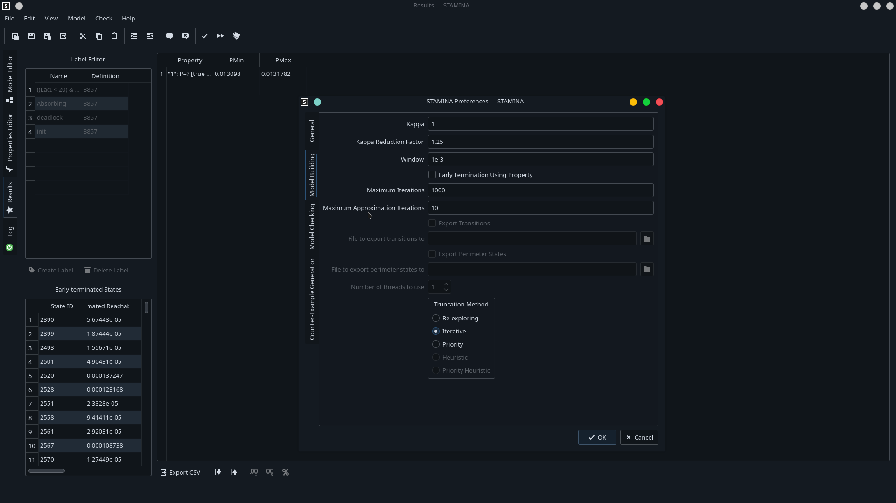

# STAMINA (STORM Integration)

[](https://www.codefactor.io/repository/github/fluentverification/stamina-storm)


## Parent Repository

To get both STAMINA/PRISM and STAMINA/STORM, please clone the parent repository, at [https://github.com/fluentverification/stamina](https://github.com/fluentverification/stamina)

## Description

Introducing STAMINA: STochastic Approximate Model-checker for INfinite-state Analysis

STAMINA is a powerful software tool designed to analyze infinite-sized Continuous-Time Markov Chains (CTMCs) and provide valuable insights for probabilistic model checking. With its C++ implementation, which interfaces seamlessly with the [Storm](https://github.com/moves-rwth/storm) probabilistic model checking engine, STAMINA offers a highly efficient and accelerated analysis process.

Key Features:

1. Efficient CTMC Analysis: STAMINA leverages its cutting-edge algorithms to analyze infinite-sized CTMCs with remarkable speed and accuracy.
2. Truncation Techniques: The software employs advanced truncation techniques to focus on the most significant areas of probability mass, ensuring an optimal balance between precision and computational complexity.
3. Probability Bounds: STAMINA delivers both an absolute minimum probability (Pmin) and an absolute maximum probability (Pmax) for the analyzed CTMCs. These bounds guarantee that the difference (Pmax - Pmin) remains within a user-specified tightness bound (w), allowing you to estimate the actual probability with high confidence.
4. C++ Implementation: The C++ version of STAMINA has been carefully optimized for performance, significantly surpassing its predecessor written in Java. The new implementation offers enhanced speed and efficiency, making it the preferred choice for conducting high-speed model checking tasks.

Note: While the Java version of STAMINA, which interfaced with the [PRISM](https://github.com/prismmodelchecker/prism) model checking engine, remains available, it is no longer actively maintained. Users are encouraged to adopt the C++ version for improved performance and feature updates.

Get started with STAMINA today and unlock the potential of analyzing infinite-sized CTMCs with speed, accuracy, and comprehensive probability bounds that converge within the specified tightness bound.

For detailed usage instructions, installation guidelines, and further information, please refer to the project's [GitHub repository](https://github.com/fluentverification/stamina-storm), [website](https://staminachecker.org), or the [project wiki](https://staminachecker.org/wiki)

### Website

Check out our website at [https://staminachecker.org](https://staminachecker.org) or view the [website's source code](https://github.com/fluentverification/staminachecker.org) on GitHub.

## To compile:

Please see our [wiki page](https://staminachecker.org/documentation/wiki/install-sstamina.html) for more information, dependency list, etc. However, assuming you have the dependencies (most notably, Storm) installed:

### On Linux and Mac:
```
git clone https://github.com/fluentverification/stamina-storm
cd bin
cmake .. -DSTORM_PATH=<PATH TO STORM DIRECTORY> -DCMAKE_CXX_COMPILER=/usr/bin/clang-cpp
make
```
Both GCC and CLang are supported, but we recommend CLang as it's STL implementation for certain hashed datasets is slightly faster.

### On Windows:

Windows is not officially supported but if Storm, CMake, Git, etc., are installed then it is possible to install STAMINA on windows. Simply invoke CMake as you would on Linux and Mac and then build the project.

## To run:
The basic syntax of running STAMINA is as follows:
```
./sstamina MODEL_FILE PROPERTIES_FILE [OPTIONS...]
```
## GUI (Work in Progress)

A new GUI is being written using QtWidgets5. This GUI will be called `xstamina` and will feature comprehensive access to all of the features of STAMINA, and will also include a few extra "goodies", such as help creating CSL properties and PRISM models.

Some features of this new GUI include (or rather, *will include*:
	- PRISM File editing/CSL Properties editing
	- Syntax highlighting for PRISM model files
	- Direct "Check" button included in the GUI
	- CSL Properties wizard
	- Label Editor
	- State viewer
	- Counterexample viewer (to integrate with the other FLUENT projects)




To compile with the GUI, you will need the following dependencies:
	- QtWidgets v5+
	- KF5

You can compile the `xstamina` executable using the `BUILD_GUI` cmake option.

```
cmake .. [OTHER CMAKE OPTIONS] -DBUILD_GUI=ON
```

Note that in order to do this, you will first need to run `CompileUiFiles.sh` in `src/stamina/gui`.
